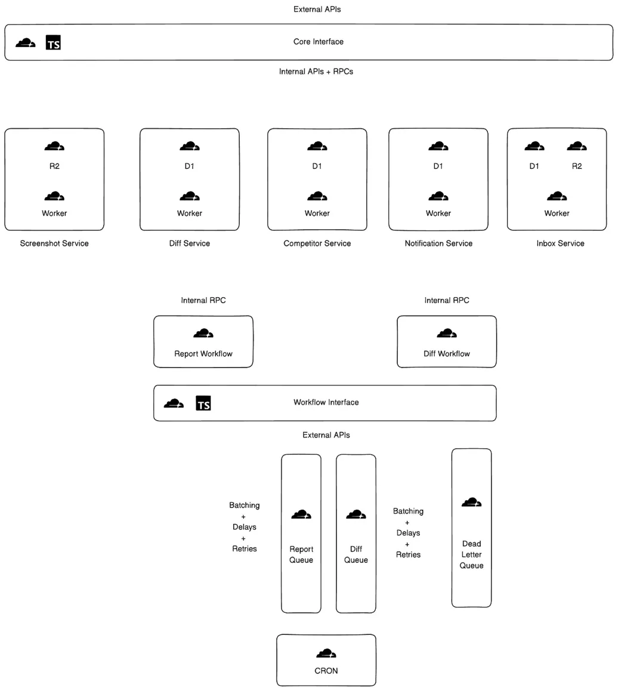

<div align="center">
  <h3 align="center">Wayback</h3>
  <p align="center">
    A minimalist engine for keeping tabs on your competitors.
    <br />
    Built entirely with Cloudflare's edge network.
    <br />
    <a href="https://github.com/wizenheimer/wayback/tree/main/docs"><strong>Explore the docs »</strong></a>
    <br />
    <br />
    <a href="https://github.com/wizenheimer/wayback/issues/new">Report Bug</a>
    ·
    <a href="https://github.com/wizenheimer/wayback/issues/new">Request Feature</a>
  </p>
</div>

## What is Wayback?

Wayback is a lightweight, open-source service that powers Byrd's competitive intelligence platform. It captures website changes, analyzes differences, and provides structured data about how sites evolve over time.

The entire project runs on Cloudflare's edge network, using `Workers` for compute, `R2` for storage, `D1` for data, `Queue`, `Workflow` and `Cron` for queueing and workflow management. We built it to be small, focused, and easy to understand.

## Core Design

Wayback follows a simple principle: capture website changes reliably and make the changes accessible to user. The system consists of five small services that work together:



### Screenshot Service

Takes care of webpage captures:

```typescript
interface ScreenshotOptions {
  url: string;
  runId: string;
  format?: "jpg" | "png" | "webp";
  fullPage?: boolean;
}
```

### Diff Service

Analyzes content changes:

```typescript
interface DiffAnalysis {
  branding: string[];
  integration: string[];
  pricing: string[];
  product: string[];
  positioning: string[];
  partnership: string[];
}
```

### Competitor Service

Manages URL grouping:

```typescript
interface Competitor {
  id: number;
  domain: string;
  name: string;
  urls: string[];
}
```

### Notification Service

Handles alerts:

```typescript
interface NotificationRequest<T> {
  templateId: T;
  emailTemplateParams: EmailTemplateMap[T];
  emails: string[];
}
```

### Inbox Service

Manages message delivery

## Getting Started

You'll need a Cloudflare Workers account with D1 and R2 access. Here's how to set things up:

1. Clone and install:

```bash
git clone https://github.com/wizenheimer/wayback.git
cd wayback
npm install
```

2. Create your databases:

```bash
wrangler d1 create diff
wrangler d1 create competitor
```

3. Set up storage:

```bash
wrangler r2 bucket create archive
```

4. Configure services (in `wrangler.toml`):

```toml
[vars]
SCREENSHOT_SERVICE_ORIGIN = "https://api.screenshotone.com"
```

5. Add your secrets:

```bash
wrangler secret put SCREENSHOT_SERVICE_API_KEY
wrangler secret put OPENAI_API_KEY
wrangler secret put RESEND_API_KEY
wrangler secret put FROM_EMAIL
```

## API

The API is RESTful and focuses on the essentials:

### Capturing Changes

```bash
# Take a new snapshot
POST /api/v1/screenshot

# Get snapshot content
GET /api/v1/screenshot/:hash/:weekNumber/:runId
GET /api/v1/content/:hash/:weekNumber/:runId
```

### Analyzing Differences

```bash
# Create a diff between versions
POST /api/v1/diff/create

# Get historical changes
GET /api/v1/diff/history

# Generate change report
POST /api/v1/report
```

### Managing URLs

```bash
# Add new URLs to track
POST /api/v1/competitors

# List tracked URLs
GET /api/v1/competitors

# Update tracking settings
PUT /api/v1/competitors/id/:id

# Remove URL from tracking
DELETE /api/v1/competitors/id/:id
```

## Data Structure

We keep the data organization simple and intuitive:

### Storage Layout

```
archive/
├── screenshot/
│   └── {urlHash}/
│       └── {weekNumber}/
│           └── {runId}
└── content/
    └── {urlHash}/
        └── {weekNumber}/
            └── {runId}
```

### Database Schema

Two tables handle all our needs:

```sql
-- Track content changes
CREATE TABLE content_diffs (
  id INTEGER PRIMARY KEY AUTOINCREMENT,
  url TEXT NOT NULL,
  run_id1 TEXT NOT NULL,
  run_id2 TEXT NOT NULL,
  week_number TEXT NOT NULL,
  branding_changes TEXT NOT NULL,
  integration_changes TEXT NOT NULL,
  pricing_changes TEXT NOT NULL,
  product_changes TEXT NOT NULL,
  positioning_changes TEXT NOT NULL,
  partnership_changes TEXT NOT NULL,
  created_at TIMESTAMP DEFAULT CURRENT_TIMESTAMP
);

-- Group related URLs
CREATE TABLE competitors (
  id INTEGER PRIMARY KEY AUTOINCREMENT,
  domain TEXT NOT NULL,
  name TEXT NOT NULL,
  created_at TIMESTAMP DEFAULT CURRENT_TIMESTAMP,
  updated_at TIMESTAMP DEFAULT CURRENT_TIMESTAMP
);

-- Store URL metadata
CREATE TABLE competitor_urls (
  id INTEGER PRIMARY KEY AUTOINCREMENT,
  competitor_id INTEGER NOT NULL,
  url TEXT NOT NULL,
  domain_hash TEXT NOT NULL,
  created_at TIMESTAMP DEFAULT CURRENT_TIMESTAMP,
  FOREIGN KEY (competitor_id) REFERENCES competitors (id) ON DELETE CASCADE,
  UNIQUE (competitor_id, url)
);
```

## Contributing

We believe in small, focused improvements. If you'd like to contribute:

1. Fork the repository
2. Create a branch (`git checkout -b feature/small-improvement`)
3. Make your changes and test them (`npm test`)
4. Submit a Pull Request with a clear description

See our [Contributing Guide](CONTRIBUTING.md) for code style and testing guidelines.

## Dependencies

We keep external dependencies minimal:

- Cloudflare Workers for compute
- R2 for storage
- D1 for data
- Screenshot One for captures
- OpenAI for text analysis
- Resend for notifications

## License

MIT License - see [LICENSE](LICENSE) for more details.
